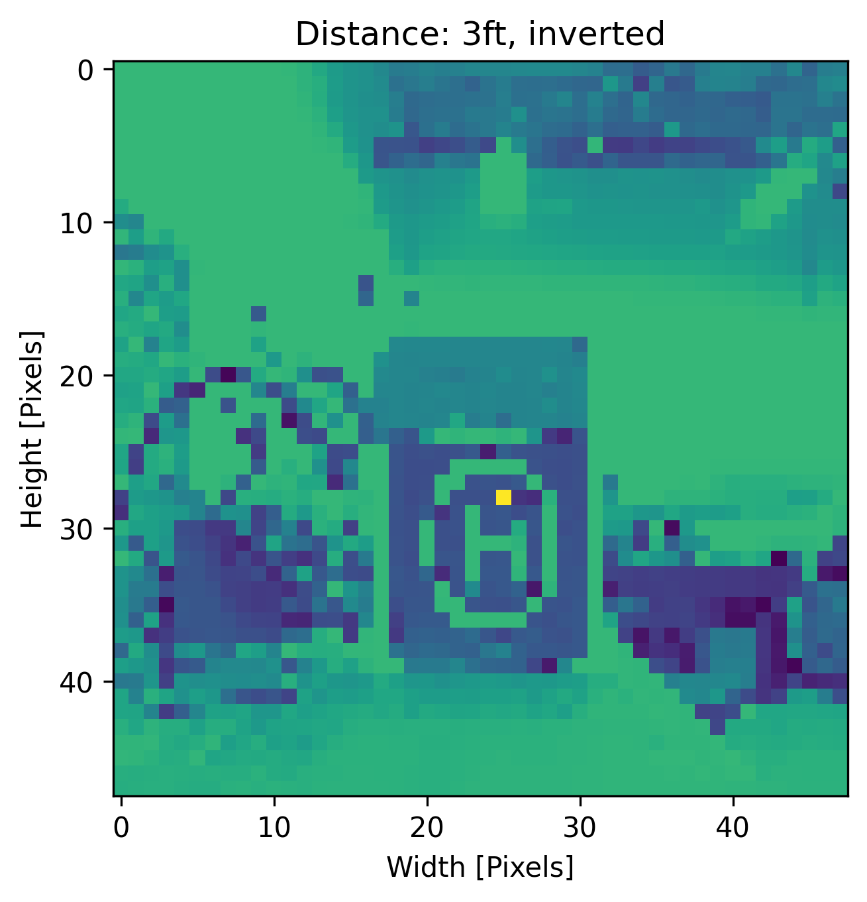

# lndpd
## Introduction
  This serves as the official repository for the landing pad project. Dubbed "lndpd" this project aims to develop a camera integrated landing pad detection system for a drone. Currently deep learning is being investigated as the intelligence behind the detection system. Pytorch is the deep learning library of choice preforming all AI task for this project.

## Basic Overview 
The directory structure is as follows:

1. datagen: holds all code related to generating training data and validation data for the CNN.
   - The code in datagen references several external directories that hold the training and validation data. Additionally, some of the code requires a file at the top level of *datagen* directory for the "*real data*" labels.

2. pytorch: holds all code related to training and inferencing the CNN
   - The code in pytorch is self-contained and requires no external directories.
   - There exist two directories in pytorch named *inference* and *train*. The *inference* directory holds code related to inferencing the CNN and the directory *train* holds code related to training the CNN.
  
 ## Pipeline
 The pipeline for this project is setup in three phases, data generation, training, and inferencing. Data in the form of images is created in the data generation phase. These images are then passed to the training phase where the CNN is trained and a saved model is produced. The inferencing phase utilizes the saved model to predict the new images. The pipeline is setup this way to allow for independence between each phase.
